# Building an NMR Instrument Around the Class Board

**Project 3** · Yi-Tsai Liang (`tojestspacja`) · last updated 2026-10-03

> **Status: design stage.** Everything below is designed and cross-checked in OpenSCAD.
> Nothing has been printed, cut or measured yet, and every spectrum on this page is
> *simulated* from the probe's geometry.

In this project, we'll take the class board, a little NMR console running at 2.1 mT and 89.4 kHz,
and turn it into an instrument you can actually put a sample in. That means a housing for the boards,
a probe that holds the coil and the sample, a magnet (well, a pair of coils) to make the field, and a
way to see what the data should look like before we ever take any. Fundamentally, we're building this:

The steps are mostly straightforward, so let's jump in!

We're using OpenSCAD here because a design written as code can check its own numbers. Every file
`echo()`s its clearances, screw lengths and cable lengths when you open it. If you'd rather use
Fusion 360, Onshape or anything else, go for it: the boards come as `.stl` and `.step` either way.

---

## The housing

### Getting the boards in

Our housing has to hold the boards we designed in Workshop 2, so the first thing we need is a model of
each one. KiCad will export them for us (`hardware/release/class-board.stl` and `front-panel.stl`).
Open each one on its own first and find the connectors: 16 SMA jacks, the OLED, three LEDs and the
terminals along the far edge.

Then stack them the way they go together: front panel face up, main board under it turned over,
11 mm between their facing surfaces (an 8.5 mm socket on a 2.5 mm insulator). That's all
`boards.scad` does, and it uses the housing's own numbers, so the two can never drift apart:

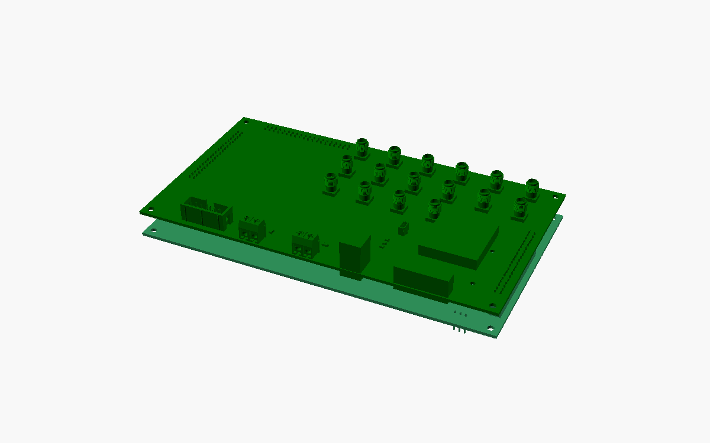

The ESP32 dev board hangs another 17 mm below the main board, and it isn't in the models at all, so
it's drawn as a plain box. Its lowest point, 34.7 mm below the panel, sets how deep the housing is.

### Two heights, one cover

Here's the catch the brief warns about. The OLED stands 13.8 mm above the panel, but an SMA jack only
9.8 mm, and a plug nut can only screw onto thread that pokes through the cover. A flat lid resting on
the OLED would bury every thread 4 mm deep 😬

So the cover sits low, 3 mm above the panel face (just enough for the header tails), and the OLED gets
its own little **hood** that comes up through a window in the cover. That leaves 4.8 mm of SMA thread
above the cover, which is plenty for a nut and a washer.

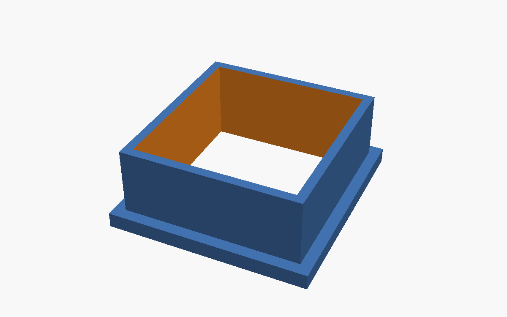

There's one more thing hiding under the cover: two optocouplers stand 3.55 mm tall, taller than the
3 mm gap. They get pockets cut into the cover's underside, which leaves 0.95 mm of cover over them.

### Sketch it, extrude it, cut it

The shell is a rounded box: 2 mm walls, 0.5 mm of clearance to the boards all round, open at the
bottom. Every hole is drawn 0.3 mm bigger than the part that goes through it. Then come the cut-outs,
all read from the board models rather than a ruler:

- 16 round holes for the SMA threads, and windows for the hood, the LEDs, Qwiic and the module header;
- the screw terminals on the far edge get a window in the cover *and* a notch in the front wall, so
  the wire comes in from the side and the screwdriver from the top;
- on the rear wall, openings for USB-C, the DC jack and the coil terminals, with room for the plug
  *and the hand that holds it*.

The shell prints upside down, cover on the bed. Every opening in a wall has a 45° V-shaped lower edge,
so the printer can bridge it without supports:

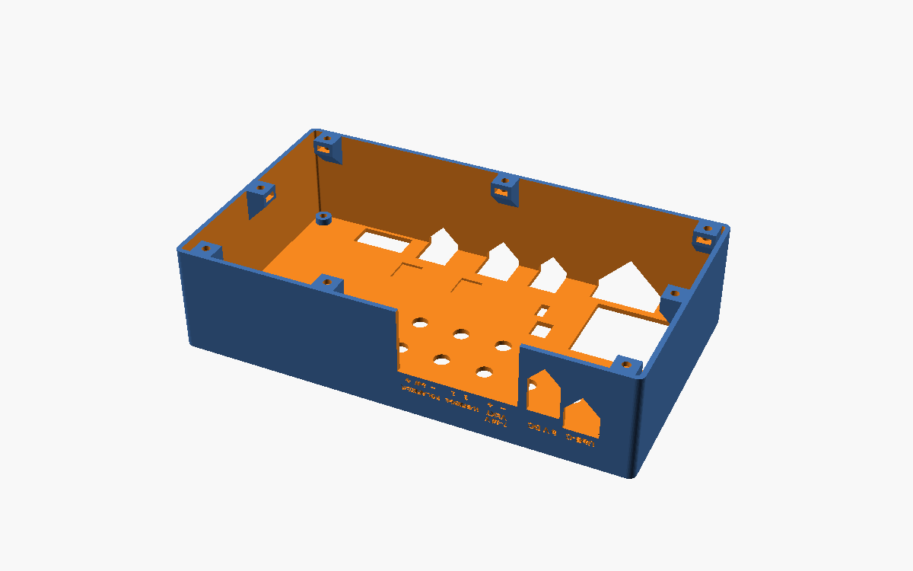

### Embossing text (and something useful)

The cover hides the panel's silkscreen, so the housing has to say what's what. Every connector is
named in text engraved 0.6 mm into the cover, and the terminals are labelled pin by pin.

The empty bit on the left got something more useful than a logo: a **B0 ↔ frequency scale**. Read the
field you're running on the top, and the proton frequency you should transmit at underneath
(f = 42.58 kHz/mT × B0), plus the local-oscillator setting that goes with it.

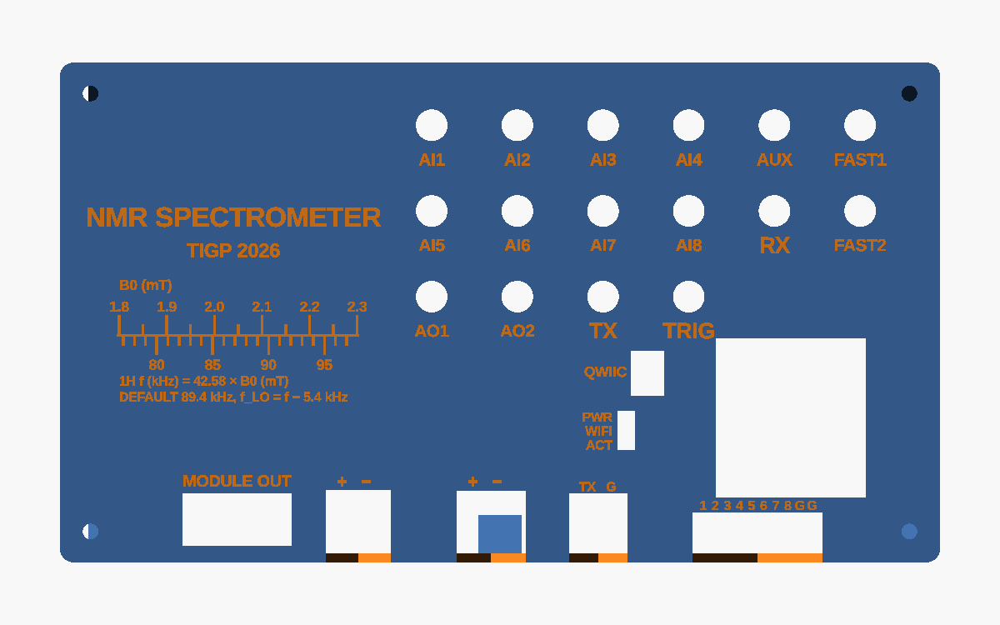

### Nuts and bolts

The bottom is a laser-cut 3 mm acrylic plate, screwed on with eight M3 × 8 screws into nuts that slide
sideways into hexagonal pockets in little bosses on the walls (5.8 mm across the flats, 2.5 mm deep).
The boards hang from the cover on their stand-offs: M3 × 12 from the top, through the cover, a 3 mm
post and the panel.

### Print the coupon first!

Before you spend hours printing a shell, print this. It has holes from 3.0 to 3.6 mm, one nut
pocket, a 2 mm wall and label samples at 2.0, 2.5 and 3.0 mm, so it tells you how *your* printer fits
before anything else does. The smallest labels on the cover are 2 mm, right at the limit, so check
that row.

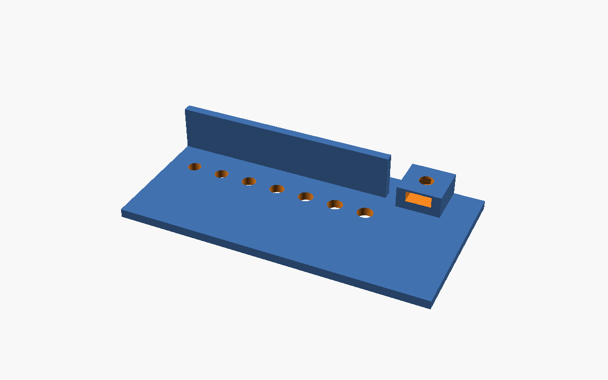

---

## The probe

### A coil you can wind

The probe is a former for the class coil: 400 turns of AWG26 on a 40 mm tube, 100 mm long, which
works out to 2 layers of 222 turns and about 51 m of wire. A few tricks are borrowed from a working
Earth's-field NMR build:

- 6 mm end cheeks, stiff enough to wind two layers under tension;
- the tube runs on past one cheek, so the leads and the cable get cable-tied to that stub, and a tug
  on the cable never reaches the winding;
- two layers end where they began, so both leads come out at the same end.

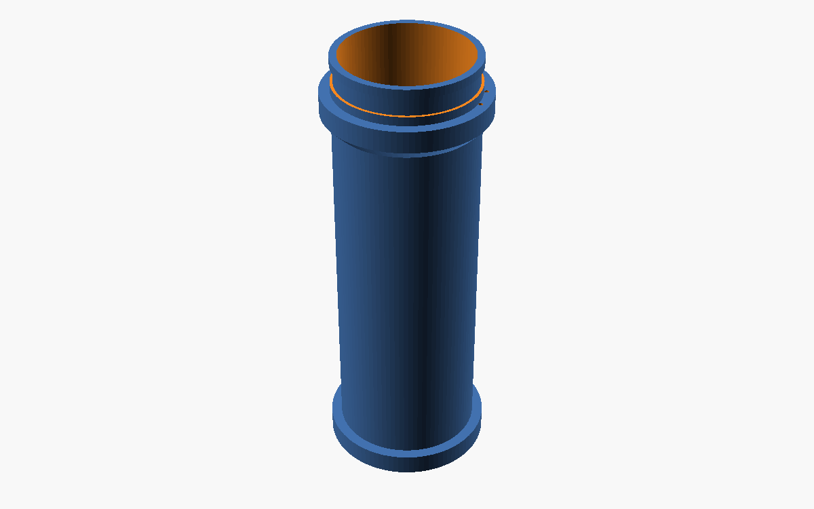

The sample is a standard 50 mL centrifuge tube, and a printed sleeve centres it in the bore. The coil
sits on a cradle with a **brass** 1/4"-20 nut for a camera tripod. No steel anywhere near the sample:
use brass or nylon screws, and check the cable's plug with a magnet before you solder it 🧲

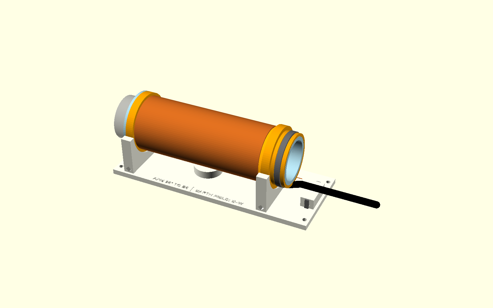

### Making the field

The repository doesn't specify the 2.1 mT magnet, so here's a reference design: a Helmholtz pair,
R = 200 mm, 2 × 312 turns of AWG16 at 1.5 A. That's 10.3 Ω, 15.5 V and 23 W, inside what the board's
H-bridge can drive. Fair warning: that's 9.2 kg of copper.

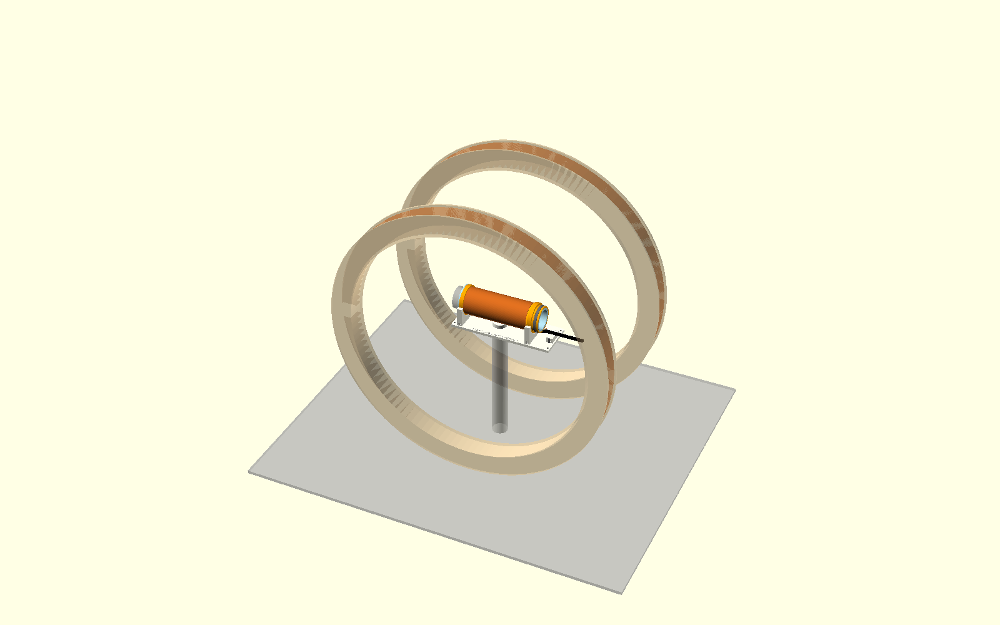

---

## What should the data look like?

### A simulator built from the probe

`spectrum.py` simulates a record the way this probe would produce it. It doesn't assume an ideal
line. It samples the coil pair's actual field over the water in the tube, waits the firmware's
1.2 ms dead time, filters the signal through the receive tank, and lets the coils warm up from scan to
scan. Every number comes from the same files the CAD uses, so the simulator and the hardware can't
quietly disagree.

### A spectrum you can hold

Following Jones et al. (*J. Chem. Educ.* 2021, 98, 1024), the data becomes a 3D print: a **field
sweep**, one spectrum per coil current. The ridge's slope is the coil pair's calibration (mT/A), and
its width is how uniform the field is (ppm). The axes are engraved round the rim, there's a groove at
half height for reading the width, and the answers are engraved underneath, so you can check yourself.

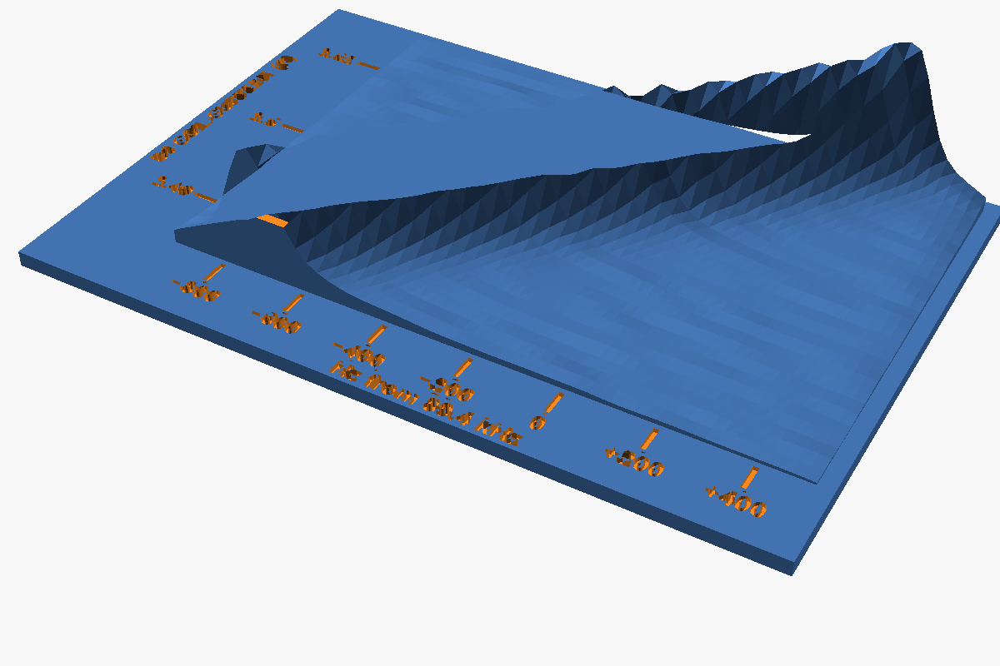

The simulator turned up the most important thing on this page. The field itself is fine: about 2 Hz
(18 ppm) across the sample. But the H-bridge drives the coils with a fixed *voltage*. As 23 W warms
the copper, its resistance rises, the current drops, and the line walks 138 Hz a minute. Averaging
scans then smears the line out, and the slope you read off the model comes out at about half the true
value. The ridge still looks perfectly straight, which is exactly what makes it a trap 🪤

### Same thing, cut from sheet

Every part also exists flat, for the laser cutter and the water-jet (`cut-*.scad`, exported by
`py export_cut.py` into `cut/`, with `CUT-LIST.md` as the shopping list). The housing becomes a
glued 3 mm acrylic box, the B0 rings come off the water-jet, and the spectrum becomes eight fins
standing in a slotted plate:

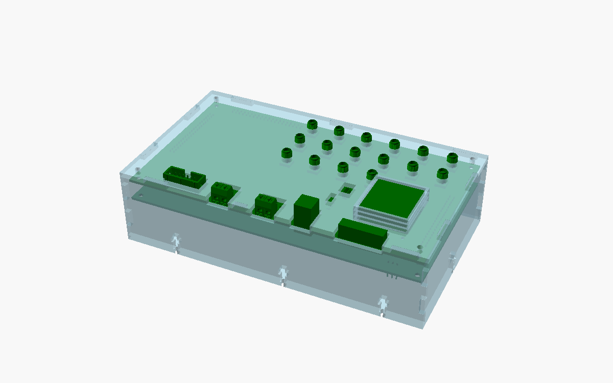

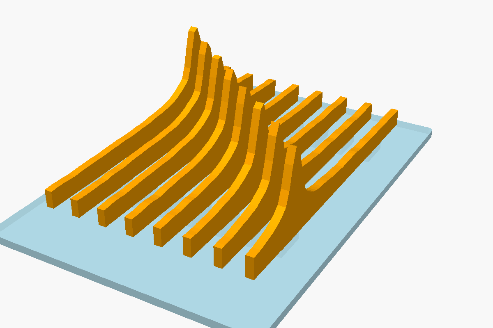

---

## What's next

Three things stand between this and a first real signal, all on the board and drive side:

1. **TX and RX share one coil.** The receiver's clamp diodes sit right across the transmitter, which
   pushes 1.54 A through R813, past the amplifier's 1.5 A limit, so every scan would abort. This
   needs a decision on the board.
2. **B0 needs constant current.** That's the biggest single lever for everything above.
3. `instrument.py` puts a Hann window over the whole 2 s record. It's nearly zero right where a short
   FID lives, so the spectrum it computes would hide the signal.

When it runs, the first samples are: water; a D₂O blank, to prove the line is really NMR; frozen
water, because solids are invisible at 89 kHz and this shows it; CuSO₄ and agarose series for T1 and
T2; and finally ¹⁹F in hexafluoro-2-propanol, to measure γ_F / γ_H = 0.9408.

## The files

| File | What it is |
|---|---|
| `nmr-params.scad` | the shared numbers: firmware defaults, the coil, water, copper. Change them here and nowhere else |
| `housing.scad` → `base-shell.stl`, `hood.stl`, `coupon.stl`, `bottom-plate.dxf` | the printed housing |
| `probe.scad` → `probe-former.stl`, `probe-sleeve.stl`, `probe-cradle.stl` | coil former, sample sleeve, tripod cradle; the B0 pair as a reference |
| `instrument.scad` | the whole bench and its cross-checks: cables, RX tank, B0 drive and drift, steel near the sample, TX/RX |
| `spectrum.py` → `spectrum-data.scad` | the simulator, or real records from `instrument nmr --csv` |
| `spectrum.scad` → `spectrum.stl` | the printed data model |
| `cut-*.scad`, `export_cut.py` → `cut/`, `CUT-LIST.md` | every part flat, for the laser and the water-jet |
| `boards.scad` | the two boards stacked, using the housing's own numbers |

To regenerate everything: run `py spectrum.py` for the data and `py export_cut.py` for the flat
parts, then export each STL from OpenSCAD with the `part` named in that file's header.
