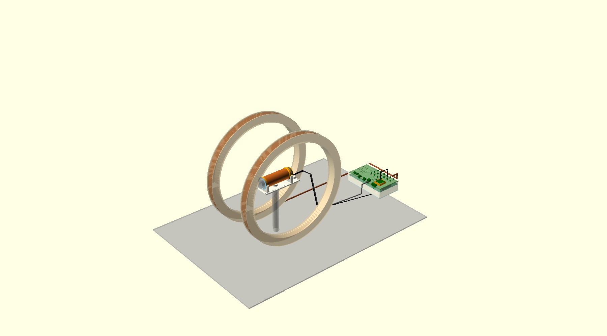

# Project 3 — a 2 mT NMR instrument: housing, probe and data models

Yi-Tsai Liang (`tojestspacja`) · status of 2026-10-02 · **work in progress**

The class board is a small NMR console (2.1 mT, 89.4 kHz proton line). This folder holds everything
mechanical around it, and a model of the data it should produce, all in OpenSCAD with one shared set of
numbers.

## Where it stands

- **Designed and checked in OpenSCAD; nothing printed, cut or measured yet.** Every spectrum shown
  here is simulated from the probe's geometry, not measured.
- The housing, the probe and the B0 coil pair fit the boards and each other; every file runs without
  errors or warnings, and each prints its own checks (clearances, screw lengths, cable lengths, the RX
  tank, the B0 drive).
- Three things stand between this and a first real signal, all on the board/drive side:
  1. **TX and RX on one coil**: the RX clamp diodes sit across the transmitter (1.54 A through R813,
     above the OPA564's 1.5 A limit), so every scan would abort. Needs a board decision.
  2. **B0 drift**: the H-bridge drives the 10.3 Ω coil pair with a fixed voltage; 23 W warms the copper
     0.39 K/min, and the line walks 138 Hz/min. The field itself is good (about 2 Hz, 18 ppm over the
     sample), so constant-current drive is the biggest lever.
  3. `instrument.py` applies a Hann window over the whole 2 s record, which is ~0 exactly where a short
     FID lives.
- First samples, when it runs: water, a D₂O blank, frozen water (solids are invisible at 89 kHz), CuSO₄
  and agarose series for T1/T2, then ¹⁹F in hexafluoro-2-propanol for γ_F/γ_H = 0.9408.

## What is here

| File | What it is |
|---|---|
| `nmr-params.scad` | the shared numbers: firmware defaults, the coil, water, copper — change them here only |
| `housing.scad` → `base-shell.stl`, `hood.stl`, `coupon.stl`, `bottom-plate.dxf` | printed shell with labelled connectors and a B0 ↔ frequency scale on the cover; print the coupon first |
| `probe.scad` → `probe-former.stl`, `probe-sleeve.stl`, `probe-cradle.stl` | coil former for the 400-turn class coil, a sleeve for a 50 mL tube, a tripod cradle; the B0 Helmholtz pair as a reference design |
| `instrument.scad` | the whole bench and its cross-checks (cables, RX tank, B0 drive and drift, steel near the sample, TX/RX) |
| `spectrum.py` → `spectrum-data.scad` | simulator from this probe's physics (field over the sample, dead time, tank, coil heating), or real records from `instrument nmr --csv` |
| `spectrum.scad` → `spectrum.stl` | a hand-held model of the data, after Jones et al., *J. Chem. Educ.* 2021, 98, 1024: a B0 field sweep whose ridge gives the coil pair's mT/A and the field's ppm; answers engraved underneath |
| `cut-*.scad`, `export_cut.py` → `cut/`, `CUT-LIST.md` | the same parts flat for the laser and the water-jet: acrylic housing, probe parts, B0 rings, spectrum fins |
| `boards.scad` | the two boards stacked, from the housing's own numbers |

Regenerate: `py spectrum.py` (data), `py export_cut.py` (all flat parts), then export each STL from
OpenSCAD with the `part` named in the file's header.
